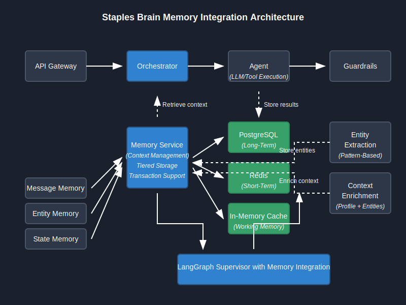

# Advanced Context and Memory Management

## Overview

This document provides a detailed technical exploration of the context and memory management systems in Staples Brain. It covers the integration of memory with LangGraph workflows, advanced state persistence strategies, and optimization techniques for high-performance context handling.



*Figure 1: High-level architecture of the memory integration system, showing tiered storage and context flow*

## Memory Integration with LangGraph

### State Management in Graph Workflows

The Staples Brain platform integrates its memory system with LangGraph workflows through a custom state management approach:

```python
async def process_message(
    self,
    message: str,
    session_id: str,
    context: Optional[Dict[str, Any]] = None
) -> Dict[str, Any]:
    """Process a message using the LangGraph workflow with memory integration."""
    
    # Initialize or retrieve conversation state
    state = await self._get_or_create_conversation_state(session_id)
    
    # Add new message to state
    state["messages"] = state.get("messages", []) + [
        {"role": "user", "content": message}
    ]
    
    # Add context to state
    state["context"] = {
        **(state.get("context", {})),
        **(context or {}),
        "session_id": session_id
    }
    
    # Execute the graph with memory-aware state
    result = await self.workflow_graph.ainvoke(state)
    
    # Persist updated state to memory
    await self._persist_conversation_state(session_id, result)
    
    # Return formatted response
    return self._format_response(result, session_id)
```

### Memory-Aware Node Execution

Nodes in the workflow graph can access and update memory directly:

```python
async def entity_extraction_node(state: Dict[str, Any]) -> Dict[str, Any]:
    """Extract entities and store them in memory."""
    # Extract message and context
    message = state.get("messages", [])[-1].get("content", "")
    context = state.get("context", {})
    session_id = context.get("session_id", "")
    
    # Extract entities
    entities = await extract_entities(message)
    
    # Store entities in memory
    if session_id and entities and memory_service:
        for entity_type, entity_value in entities.items():
            await memory_service.store(
                session_id=session_id,
                memory_type=MemoryType.ENTITY,
                content=json.dumps({entity_type: entity_value}),
                scope=MemoryScope.SHORT_TERM,
                metadata={
                    "entity_type": entity_type,
                    "extracted_from": message[:100]
                }
            )
    
    # Update state with extracted entities
    state["entities"] = entities
    return state
```

## Transactional Memory Operations

For critical memory operations, the system implements transactional guarantees:

```python
async def transactional_memory_update(
    session_id: str,
    operations: List[Dict[str, Any]]
) -> bool:
    """
    Perform multiple memory operations as a single transaction.
    
    Args:
        session_id: Session identifier
        operations: List of memory operations
        
    Returns:
        Success status
    """
    async with memory_service.transaction() as txn:
        try:
            # Execute all operations in a transaction
            for op in operations:
                op_type = op.get("type", "store")
                
                if op_type == "store":
                    await txn.store(
                        session_id=session_id,
                        memory_type=op.get("memory_type"),
                        content=op.get("content"),
                        scope=op.get("scope", MemoryScope.SHORT_TERM),
                        metadata=op.get("metadata", {})
                    )
                elif op_type == "delete":
                    await txn.delete(
                        entry_id=op.get("entry_id")
                    )
                elif op_type == "update":
                    await txn.update(
                        entry_id=op.get("entry_id"),
                        content=op.get("content"),
                        metadata=op.get("metadata")
                    )
            
            # Commit transaction
            await txn.commit()
            return True
        
        except Exception as e:
            # Transaction will automatically roll back
            logger.error(f"Transaction failed: {str(e)}", exc_info=True)
            return False
```

## Memory Lifecycle Management

### Memory Expiration Policies

The system implements configurable memory expiration policies:

```python
class MemoryExpirationConfig:
    """Configuration for memory expiration policies."""
    
    def __init__(
        self,
        working_memory_ttl: int = 300,     # 5 minutes
        short_term_ttl: int = 86400,       # 24 hours
        long_term_ttl: Optional[int] = None,  # No expiration
        max_session_messages: int = 50     # Maximum messages per session
    ):
        self.working_memory_ttl = working_memory_ttl
        self.short_term_ttl = short_term_ttl
        self.long_term_ttl = long_term_ttl
        self.max_session_messages = max_session_messages
```

### Memory Pruning

To prevent memory overload, the system automatically prunes old entries:

```python
async def prune_session_memory(
    session_id: str,
    max_messages: int = 50
) -> int:
    """
    Prune old messages from a session to prevent context overflow.
    
    Args:
        session_id: Session identifier
        max_messages: Maximum messages to keep
        
    Returns:
        Number of pruned messages
    """
    try:
        # Get all messages for the session
        messages = await memory_service.retrieve(
            session_id=session_id,
            memory_type=MemoryType.MESSAGE,
            limit=1000  # Large limit to get all messages
        )
        
        # If we have more than max_messages, delete the oldest ones
        if len(messages) > max_messages:
            # Sort by timestamp (oldest first)
            messages.sort(key=lambda x: x.get("timestamp", ""))
            
            # Calculate how many to delete
            delete_count = len(messages) - max_messages
            
            # Get IDs to delete
            ids_to_delete = [msg.get("id") for msg in messages[:delete_count]]
            
            # Delete messages
            for entry_id in ids_to_delete:
                await memory_service.delete(entry_id)
            
            return delete_count
        
        return 0
    
    except Exception as e:
        logger.error(f"Error pruning session memory: {str(e)}", exc_info=True)
        return 0
```

## Context Enrichment


*Figure 2: The context enrichment process, showing how the system builds rich context from multiple sources*

### Entity-Based Context Enrichment

The system enriches context based on recognized entities:

```python
async def enrich_context_with_entities(
    context: Dict[str, Any],
    session_id: str
) -> Dict[str, Any]:
    """
    Enrich context with entities from memory.
    
    Args:
        context: Current context
        session_id: Session identifier
        
    Returns:
        Enriched context
    """
    enriched_context = context.copy()
    
    # Initialize entity memory if not present
    if "entity_memory" not in enriched_context:
        enriched_context["entity_memory"] = {}
    
    try:
        # Retrieve entities from memory
        entity_entries = await memory_service.retrieve(
            session_id=session_id,
            memory_type=MemoryType.ENTITY,
            limit=100
        )
        
        # Process each entity
        for entry in entity_entries:
            try:
                # Parse entity content
                entity_data = json.loads(entry.get("content", "{}"))
                entity_type = entry.get("metadata", {}).get("entity_type")
                
                # Add to context
                if entity_type and entity_data:
                    for key, value in entity_data.items():
                        enriched_context["entity_memory"][key] = value
            except json.JSONDecodeError:
                continue
        
        return enriched_context
    
    except Exception as e:
        logger.error(f"Error enriching context: {str(e)}", exc_info=True)
        return context
```

### Customer Profile Integration

For authenticated users, the system enriches context with customer profiles:

```python
async def enrich_with_customer_profile(
    context: Dict[str, Any]
) -> Dict[str, Any]:
    """
    Enrich context with customer profile information.
    
    Args:
        context: Current context
        
    Returns:
        Enriched context
    """
    enriched_context = context.copy()
    
    # Check for customer ID
    customer_id = context.get("customer_id")
    if not customer_id:
        return enriched_context
    
    try:
        # Retrieve customer profile
        customer_profile = await customer_service.get_customer_profile(customer_id)
        
        if customer_profile:
            # Add profile to context
            enriched_context["customer_profile"] = {
                "name": customer_profile.name,
                "email": customer_profile.email,
                "account_type": customer_profile.account_type,
                "preferences": customer_profile.preferences,
                "last_orders": [
                    {"id": order.id, "date": order.date, "status": order.status}
                    for order in customer_profile.recent_orders[:3]
                ] if customer_profile.recent_orders else []
            }
        
        return enriched_context
    
    except Exception as e:
        logger.error(f"Error retrieving customer profile: {str(e)}", exc_info=True)
        return enriched_context
```

## Memory Optimization

### Tiered Memory Implementation

For high-performance applications, the system implements a tiered memory approach:

```python
class TieredMemoryService:
    """
    Tiered memory service with different storage strategies based on scope.
    
    This provides optimized storage with:
    - In-memory cache for working memory (fastest)
    - Redis for short-term memory (fast)
    - PostgreSQL for long-term memory (persistent)
    """
    
    def __init__(
        self,
        redis_client: Optional[Redis] = None,
        db_session: Optional[AsyncSession] = None
    ):
        """Initialize the tiered memory service."""
        self.working_memory = {}  # In-memory cache
        self.redis_client = redis_client
        self.db_session = db_session
    
    async def store(
        self,
        session_id: str,
        memory_type: str,
        content: str,
        scope: str = "short_term",
        metadata: Optional[Dict[str, Any]] = None
    ) -> str:
        """Store memory with tiered approach based on scope."""
        entry_id = str(uuid.uuid4())
        
        if scope == "working":
            # Store in-memory for fastest access
            key = f"{session_id}:{memory_type}:{entry_id}"
            self.working_memory[key] = {
                "content": content,
                "metadata": metadata or {},
                "timestamp": datetime.now().isoformat()
            }
        elif scope == "short_term" and self.redis_client:
            # Store in Redis for fast access
            key = f"memory:{session_id}:{memory_type}:{entry_id}"
            await self.redis_client.set(
                key,
                json.dumps({
                    "content": content,
                    "metadata": metadata or {},
                    "timestamp": datetime.now().isoformat()
                }),
                ex=86400  # Expire after 24 hours
            )
        else:
            # Store in database for persistence
            await self._store_in_db(
                session_id,
                memory_type,
                entry_id,
                content,
                scope,
                metadata
            )
        
        return entry_id
```

### Memory Caching Strategies

The system implements caching strategies for frequently accessed memory:

```python
class MemoryCacheManager:
    """
    Cache manager for memory entries.
    
    Implements caching strategies for frequently accessed memory entries
    to improve performance and reduce database load.
    """
    
    def __init__(self, cache_size: int = 1000):
        """Initialize the cache manager."""
        self.cache = LRUCache(maxsize=cache_size)
        self.entity_cache = {}  # Session-specific entity cache
    
    def cache_memory_entry(self, entry_id: str, entry: Dict[str, Any]) -> None:
        """Cache a memory entry."""
        self.cache[entry_id] = entry
    
    def get_cached_entry(self, entry_id: str) -> Optional[Dict[str, Any]]:
        """Get a cached memory entry."""
        return self.cache.get(entry_id)
    
    def cache_entity(self, session_id: str, entity_type: str, entity_value: Any) -> None:
        """Cache an entity for a session."""
        if session_id not in self.entity_cache:
            self.entity_cache[session_id] = {}
        
        self.entity_cache[session_id][entity_type] = {
            "value": entity_value,
            "timestamp": datetime.now().isoformat()
        }
    
    def get_cached_entity(self, session_id: str, entity_type: str) -> Optional[Any]:
        """Get a cached entity."""
        if session_id in self.entity_cache and entity_type in self.entity_cache[session_id]:
            return self.entity_cache[session_id][entity_type]["value"]
        return None
    
    def clear_session_cache(self, session_id: str) -> None:
        """Clear cache for a session."""
        if session_id in self.entity_cache:
            del self.entity_cache[session_id]
```

## Integration with LangGraph Supervisor


*Figure 3: LangGraph Supervisor integration with memory system, showing flow and component interactions*

When transitioning to a LangGraph Supervisor, memory integration is maintained:

```python
async def supervisor_with_memory(state: Dict[str, Any]) -> Dict[str, Any]:
    """
    LangGraph supervisor with memory integration.
    
    Args:
        state: Current state
        
    Returns:
        Updated state with routing decision
    """
    # Extract message and session context
    message = state.get("messages", [])[-1].get("content", "") if state.get("messages") else ""
    context = state.get("context", {})
    session_id = context.get("session_id", "")
    
    # Enrich context with entities from memory
    if session_id:
        enriched_context = await enrich_context_with_entities(context, session_id)
        state["context"] = enriched_context
    
    # Perform agent selection (pattern matching, vector search, etc.)
    # ... (agent selection logic) ...
    
    # Store routing decision in memory for observability
    if session_id:
        await memory_service.store(
            session_id=session_id,
            memory_type="ROUTING",
            content=json.dumps({
                "agent_id": selected_agent_id,
                "confidence": confidence,
                "selection_method": selection_method
            }),
            metadata={
                "query": message[:100],
                "timestamp": datetime.now().isoformat()
            }
        )
    
    # Return routing decision
    return {
        "next": selected_agent_id,
        "agent_id": selected_agent_id,
        "confidence": confidence,
        "selection_method": selection_method
    }
```

## Performance Metrics

The system tracks key performance metrics for memory operations:

| Metric | Target | Optimization Strategy |
|--------|--------|------------------------|
| Memory Retrieval Latency | <10ms | Redis caching for frequent access |
| Memory Storage Latency | <20ms | Async batching for multiple entries |
| Entity Extraction Time | <50ms | Pre-compiled patterns and caching |
| Context Enrichment Time | <15ms | Parallel processing of context sources |
| State Persistence Time | <30ms | JSON compression and optimized indices |

## Best Practices for Advanced Use Cases

1. **High-Traffic Deployments**
   - Use Redis for short-term memory to reduce database load
   - Implement entity caching with appropriate TTLs
   - Consider memory sharding for very large deployments

2. **Cross-Session Context**
   - Extract and store entities with LONG_TERM scope
   - Implement customer profile integration for authenticated users
   - Use Postgres vector search for semantic recall of past interactions

3. **Multi-Agent Memory Sharing**
   - Tag memory entries with agent IDs for tracking
   - Implement memory visibility rules for sensitive information
   - Use transaction batching for multiple memory updates

4. **Memory Monitoring**
   - Track memory growth rates per session
   - Implement automatic pruning for long sessions
   - Log memory access patterns for performance tuning

5. **Memory Security**
   - Implement memory encryption for sensitive data
   - Create memory access control mechanisms
   - Provide memory redaction capabilities for PII

## Conclusion

The advanced context and memory management capabilities of Staples Brain provide a powerful foundation for building sophisticated multi-agent systems. By leveraging tiered storage, transactional guarantees, and optimized retrieval patterns, the system delivers high-performance context awareness while maintaining data integrity and security.

For basic memory management concepts, see the [Session Context Management](session_context.md) guide.