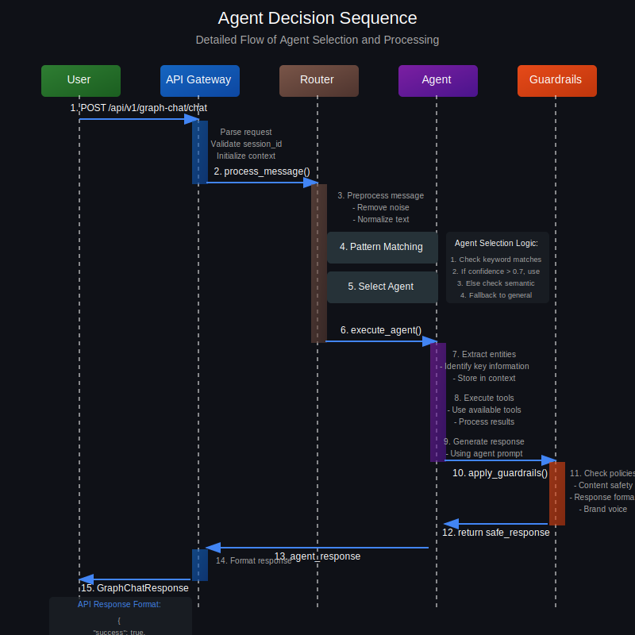

# Agent Selection Process

## Overview

The agent selection process is a core component of the Staples Brain multi-agent orchestration platform. It determines which specialized agent should handle a user's query based on intent detection, pattern matching, and semantic understanding.

This document provides a detailed visual and technical explanation of how the system routes user messages to appropriate agents.

## Agent Selection Flow


The agent selection follows a deterministic process designed to maximize accuracy while maintaining performance:

1. **User Message Intake**
   - The process begins when a user sends a message through the chat interface
   - This message is received by the API Gateway at `/api/v1/graph-chat/chat`
   - The message is validated and parsed into the `GraphChatRequest` format

2. **Preprocessing**
   - The message undergoes preprocessing to:
     - Remove noise and unnecessary characters
     - Normalize text (lowercase, spacing, etc.)
     - Extract initial context clues
   - The preprocessed message is then passed to the pattern matching and semantic matching modules

3. **Pattern Matching (Primary Method)**
   - Each agent in the system has defined pattern capabilities using regex patterns
   - The system matches the preprocessed message against these patterns
   - If a **strong match** is found (confidence > 0.7), the system directly routes to that specialized agent
   - This method provides fast, deterministic routing for well-defined intents

4. **Semantic Matching (Secondary Method)**
   - If no strong pattern match is found, the system falls back to semantic matching
   - The preprocessed message is converted to a vector embedding
   - This embedding is compared to agent capability vectors using cosine similarity
   - If a **good match** is found (confidence > 0.5), the system routes to that specialized agent
   - This method handles variations in phrasing and less explicit intents

5. **Conversational Check (Fallback)**
   - If no good semantic match is found, the system performs a conversational check
   - This determines if the message is conversational in nature (greeting, small talk, etc.)
   - Messages identified as conversational are routed to the General Conversation agent
   - This ensures a seamless experience even when intent is unclear

6. **Agent Execution**
   - Once an agent is selected, control is passed to that agent for message processing
   - The selected agent, confidence score, and selection method are recorded for telemetry
   - The agent processes the message according to its specialized capabilities

## Detailed Selection Sequence



The sequence diagram above illustrates the step-by-step process of agent selection and execution:

1. **API Request**: User message is sent to `/api/v1/graph-chat/chat` endpoint
2. **Gateway Processing**: Request is parsed, validated, and the session context is loaded
3. **Router Invocation**: The message is passed to the agent router for intent detection
4. **Pattern Matching**: Message is matched against regex patterns defined for each agent
5. **Agent Selection**: The best matching agent is selected based on confidence scores
6. **Agent Execution**: Selected agent processes the message with its specialized logic
7. **Guardrails Application**: Response passes through guardrails for safety and quality
8. **Response Delivery**: Final response is formatted and returned to the user

## Architectural Components


The agent selection process involves several key architectural components:

1. **API Gateway**
   - Entry point for all chat requests
   - Implements the `/api/v1/graph-chat/chat` endpoint
   - Validates requests and manages authentication
   - Sample request:
     ```json
     {
       "message": "I need to reset my password",
       "session_id": "user-123-session",
       "context": {
         "customer_id": "cust-456",
         "previous_agents": ["general_conversation"]
       }
     }
     ```

2. **GraphBrainService**
   - Core orchestration service
   - Manages the overall message processing flow
   - Coordinates between router, agents, and memory services
   - Implementation in `backend/services/graph_brain_service.py`

3. **AgentRouter**
   - Specialized component for intent detection and agent selection
   - Implements pattern matching and semantic matching algorithms
   - Makes final routing decisions based on confidence scores
   - Implementation in `backend/services/agent_router.py`

4. **PatternStore**
   - Maintains registry of regex patterns for intent detection
   - Loaded from agent definitions in the database
   - Provides fast keyword-based filtering
   - Example pattern for Reset Password agent:
     ```
     pattern = r'password|reset password|forgot password|change password|login issue'
     confidence = 0.85
     ```

5. **VectorStore**
   - Manages vector embeddings for semantic matching
   - Provides similarity search capabilities
   - Used as a fallback when pattern matching is inconclusive
   - Implementation in `backend/services/vector_store.py`

6. **AgentFactory**
   - Creates agent instances dynamically from database definitions
   - Loads agent-specific configurations and tools
   - Integrates with the memory system for context management
   - Implementation in `backend/services/agent_factory.py`

7. **MemoryService**
   - Provides context persistence across conversation turns
   - Stores entities, facts, and conversation history
   - Enables agents to maintain state and continuity
   - Implementation in `backend/memory/mem0.py`

## Pattern Matching Implementation

The pattern matching component is the primary method for agent selection, providing fast, deterministic routing:

```python
async def keyword_prefilter(self, query: str) -> List[Tuple[AgentDefinition, float]]:
    """
    Filter agents based on keyword patterns in the query.
    
    Args:
        query: User query text
        
    Returns:
        List of (agent, confidence) tuples for agents with matching patterns
    """
    matches = []
    
    # Normalize query for pattern matching
    normalized_query = query.lower().strip()
    
    # Check each agent's patterns
    for agent_id, agent_def in self.agents.items():
        # Skip agents without pattern capabilities
        if not agent_def.pattern_capabilities:
            continue
            
        # Check each pattern
        for pattern in agent_def.pattern_capabilities:
            # Skip inactive patterns
            if not pattern.active:
                continue
                
            # Check if pattern matches query
            if re.search(pattern.regex, normalized_query, re.IGNORECASE):
                matches.append((agent_def, pattern.confidence))
                # Only use the highest confidence pattern per agent
                break
    
    # Sort by confidence (descending)
    return sorted(matches, key=lambda x: x[1], reverse=True)
```

## Semantic Matching Implementation

The semantic matching component serves as a fallback when pattern matching doesn't produce strong matches:

```python
async def semantic_search(self, query: str, top_k: int = 3) -> List[Tuple[AgentDefinition, float]]:
    """
    Find agents semantically related to the query.
    
    Args:
        query: User query text
        top_k: Number of top results to return
        
    Returns:
        List of (agent, similarity) tuples for the most similar agents
    """
    # Get query embedding
    query_embedding = await self._get_embedding(query)
    
    # Search vector store
    results = self.vector_store.search(
        query_embedding, 
        top_k=top_k,
        min_similarity=0.5  # Minimum similarity threshold
    )
    
    # Map results to agents
    matches = []
    for agent_id, similarity in results:
        if agent_id in self.agents:
            matches.append((self.agents[agent_id], similarity))
    
    return matches
```

## Selection Decision Logic

The final selection logic combines pattern matching and semantic matching results:

```python
async def route_message(self, message: str, context: Optional[Dict[str, Any]] = None) -> Tuple[AgentDefinition, float, Dict[str, Any]]:
    """
    Route a message to the appropriate agent.
    
    Args:
        message: User message
        context: Optional context information
        
    Returns:
        Tuple of (selected agent, confidence, updated context)
    """
    # Initialize routing context
    route_context = {"selection_method": "unknown"}
    context = context or {}
    
    # Check for direct routing override
    if context.get("direct_agent_id"):
        agent_id = context["direct_agent_id"]
        if agent_id in self.agents:
            route_context["selection_method"] = "direct_routing"
            return self.agents[agent_id], 1.0, route_context
    
    # Try pattern matching first (fastest method)
    prefiltered_agents = await self.keyword_prefilter(message)
    
    # If we have exactly one high-confidence match from patterns, use it directly
    if len(prefiltered_agents) == 1 and prefiltered_agents[0][1] > 0.7:
        agent, confidence = prefiltered_agents[0]
        route_context["selection_method"] = "strong_intent_match"
        return agent, confidence, route_context
    
    # If we have multiple matches or low confidence, try semantic search
    semantic_matches = await self.semantic_search(message, top_k=3)
    
    # If we have a good semantic match, use it
    if semantic_matches and semantic_matches[0][1] > 0.5:
        agent, confidence = semantic_matches[0]
        route_context["selection_method"] = "semantic_match"
        return agent, confidence, route_context
    
    # Check if this seems like a conversational message
    if self._seems_conversational(message):
        general_agent = await self._get_general_agent()
        route_context["selection_method"] = "conversational_fallback"
        return general_agent, 0.7, route_context
    
    # Fall back to general conversation agent
    general_agent = await self._get_general_agent()
    route_context["selection_method"] = "default_fallback"
    return general_agent, 0.6, route_context
```

## Performance Considerations

The agent selection process is designed with performance in mind:

1. **Pattern Matching First**: The system tries pattern matching first, as it's faster than semantic matching
2. **Early Exit**: High-confidence matches allow the system to skip more expensive operations
3. **Optimized Regex**: Regex patterns are carefully designed and optimized for performance
4. **Caching**: Agent definitions and patterns are cached to avoid repeated database lookups
5. **Tiered Approach**: The system uses a tiered approach, from fastest to most accurate methods

## Best Practices for Agent Routing

1. **Pattern Design**
   - Define clear, specific patterns for each agent
   - Set appropriate confidence thresholds based on pattern specificity
   - Include common variations of key phrases
   - Test patterns with varied inputs to ensure accuracy

2. **Agent Boundaries**
   - Define clear boundaries between agent responsibilities
   - Avoid overlapping patterns that could cause routing conflicts
   - Provide specialized patterns for edge cases
   - Define hierarchical relationships between agents when needed

3. **Fallback Handling**
   - Ensure the General Conversation agent can handle a wide range of queries
   - Implement proper conversational detection for small talk
   - Consider session context for improved continuity

4. **Monitoring and Tuning**
   - Track agent selection metrics (selected agent, confidence, method)
   - Identify frequently misrouted queries
   - Adjust patterns and confidence thresholds based on real usage data
   - Add new patterns for emerging query patterns

## Troubleshooting

| Issue | Possible Cause | Resolution |
|-------|----------------|------------|
| Query routed to wrong agent | Pattern conflict | Review patterns for specificity and adjust confidence levels |
| Low confidence for explicit intents | Missing pattern variants | Add additional pattern variations |
| Queries always fall back to general | Patterns too specific | Add broader patterns with lower confidence |
| Similar queries route differently | Inconsistent patterns | Standardize patterns across similar intents |
| Poor semantic matching | Embedding issues | Retrain embeddings with more examples |

## Future Enhancements

1. **Machine Learning-Based Routing**
   - Train a classifier for improved intent detection
   - Use historical routing decisions as training data
   - Implement feedback loop for continuous improvement

2. **Contextual Routing**
   - Consider previous agents in conversation history
   - Weight routing decisions based on conversation flow
   - Implement topic modeling for improved context awareness

3. **Adaptive Confidence Thresholds**
   - Dynamically adjust confidence thresholds based on performance
   - Personalize thresholds for different user types
   - Implement A/B testing for threshold optimization