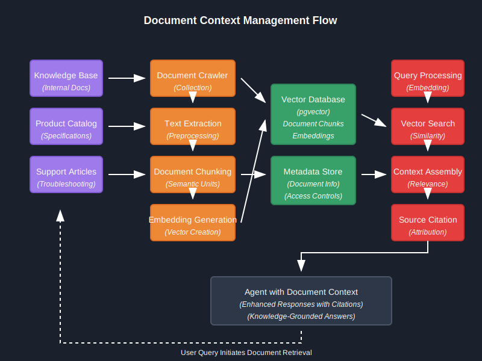

# Document Context Management

## Overview

The Staples Brain platform provides advanced document context management capabilities, allowing agents to reference, analyze, and incorporate information from various document sources. This integration enables agents to provide accurate, contextualized responses based on organizational knowledge stored in documents.



*Figure 1: Document context management flow showing ingestion, processing, storage, and retrieval*

## Document Integration Architecture

The document context system consists of the following components:

```
┌────────────────────┐    ┌───────────────────┐    ┌───────────────────┐
│                    │    │                   │    │                   │
│  Document Sources  │───▶│ Document Processor│───▶│  Vector Database  │
│                    │    │                   │    │                   │
└────────────────────┘    └───────────────────┘    └───────────────────┘
          │                         │                       │
          │                         │                       │
          ▼                         ▼                       ▼
┌────────────────────┐    ┌───────────────────┐    ┌───────────────────┐
│                    │    │                   │    │                   │
│  Document Crawler  │    │ Metadata Extractor│    │  Retrieval Service│
│                    │    │                   │    │                   │
└────────────────────┘    └───────────────────┘    └───────────────────┘
                                                            │
                                                            │
                                                            ▼
                                                   ┌───────────────────┐
                                                   │                   │
                                                   │  Agent Framework  │
                                                   │                   │
                                                   └───────────────────┘
```

### Core Components

1. **Document Sources**
   - Internal knowledge bases
   - Product documentation
   - Policy manuals
   - Technical specifications
   - Customer support articles

2. **Document Processor**
   - Text extraction
   - Chunking strategies
   - Entity recognition
   - Link analysis

3. **Vector Database**
   - Document embeddings
   - Semantic search capabilities
   - Metadata indexing
   - Versioning support

4. **Retrieval Service**
   - Context-aware document retrieval
   - Relevance ranking
   - Filtering capabilities
   - Cross-document relationships

## Document Integration Models

### Document Metadata Model

```python
class DocumentMetadata(BaseModel):
    """Metadata for document context management."""
    
    doc_id: str = Field(..., description="Unique document identifier")
    title: str = Field(..., description="Document title")
    source: str = Field(..., description="Document source (e.g., 'knowledge_base', 'product_catalog')")
    doc_type: str = Field(..., description="Document type (e.g., 'policy', 'manual', 'specification')")
    created_at: datetime = Field(..., description="Document creation timestamp")
    updated_at: Optional[datetime] = Field(None, description="Last update timestamp")
    version: Optional[str] = Field(None, description="Document version")
    author: Optional[str] = Field(None, description="Document author")
    tags: List[str] = Field(default_factory=list, description="Document tags for categorization")
    language: str = Field(default="en", description="Document language")
    access_level: str = Field(default="public", description="Document access level")
    expiration: Optional[datetime] = Field(None, description="Document expiration date")
```

### Document Chunk Model

```python
class DocumentChunk(BaseModel):
    """Model representing a chunk of a document with metadata."""
    
    chunk_id: str = Field(..., description="Unique chunk identifier")
    doc_id: str = Field(..., description="Parent document identifier")
    content: str = Field(..., description="Chunk text content")
    embedding: Optional[List[float]] = Field(None, description="Vector embedding of chunk content")
    metadata: DocumentMetadata = Field(..., description="Document metadata")
    chunk_index: int = Field(..., description="Chunk index within document")
    total_chunks: int = Field(..., description="Total chunks in document")
    prev_chunk_id: Optional[str] = Field(None, description="Previous chunk identifier")
    next_chunk_id: Optional[str] = Field(None, description="Next chunk identifier")
    heading_path: Optional[List[str]] = Field(None, description="Document heading path to this chunk")
```

## Document Processing Pipeline

### Ingestion Workflow

The document ingestion process follows these steps:

1. **Document Collection**
   - Crawl configured document sources
   - Monitor for document updates
   - Validate document formats

2. **Preprocessing**
   - Convert documents to plain text
   - Clean and normalize content
   - Extract document structure

3. **Chunking**
   - Split documents into semantic chunks
   - Preserve context across chunk boundaries
   - Maintain hierarchical structure

4. **Embedding Generation**
   - Generate vector embeddings for each chunk
   - Map embeddings to chunk metadata
   - Store in vector database

```python
async def process_document(
    document_path: str,
    source: str,
    doc_type: str,
    metadata: Optional[Dict[str, Any]] = None
) -> str:
    """
    Process a document file and store it in the document database.
    
    Args:
        document_path: Path to document file
        source: Document source
        doc_type: Document type
        metadata: Additional metadata
        
    Returns:
        Document ID of processed document
    """
    # Generate document ID
    doc_id = str(uuid.uuid4())
    
    # Extract text content
    content = await extract_document_text(document_path)
    
    # Extract document structure
    structure = extract_document_structure(content)
    
    # Create document metadata
    doc_metadata = DocumentMetadata(
        doc_id=doc_id,
        title=extract_title(content) or os.path.basename(document_path),
        source=source,
        doc_type=doc_type,
        created_at=datetime.now(),
        **metadata or {}
    )
    
    # Chunk document
    chunks = chunk_document(content, structure)
    
    # Process chunks
    for i, chunk in enumerate(chunks):
        chunk_id = f"{doc_id}_chunk_{i}"
        
        # Create chunk metadata
        chunk_metadata = DocumentChunk(
            chunk_id=chunk_id,
            doc_id=doc_id,
            content=chunk["text"],
            metadata=doc_metadata,
            chunk_index=i,
            total_chunks=len(chunks),
            prev_chunk_id=f"{doc_id}_chunk_{i-1}" if i > 0 else None,
            next_chunk_id=f"{doc_id}_chunk_{i+1}" if i < len(chunks) - 1 else None,
            heading_path=chunk.get("heading_path")
        )
        
        # Generate embedding
        embedding = await generate_embedding(chunk["text"])
        chunk_metadata.embedding = embedding
        
        # Store chunk in database
        await store_document_chunk(chunk_metadata)
    
    # Store document metadata
    await store_document_metadata(doc_metadata)
    
    return doc_id
```

### Document Chunking Strategies

The system implements multiple chunking strategies to optimize for different document types:

1. **Fixed Size Chunking**
   - Simple chunks of N tokens
   - Overlapping windows for context preservation

2. **Semantic Chunking**
   - Natural language boundaries
   - Topic-based segmentation
   - Hierarchical structure preservation

3. **Hybrid Chunking**
   - Combines structural and semantic approaches
   - Adapts to document structure
   - Preserves section boundaries

```python
def chunk_document(
    content: str,
    structure: Dict[str, Any],
    strategy: str = "hybrid",
    chunk_size: int = 1000,
    chunk_overlap: int = 200
) -> List[Dict[str, Any]]:
    """
    Chunk a document based on the specified strategy.
    
    Args:
        content: Document content
        structure: Document structure
        strategy: Chunking strategy ('fixed', 'semantic', 'hybrid')
        chunk_size: Target chunk size in tokens
        chunk_overlap: Overlap between chunks in tokens
        
    Returns:
        List of document chunks with metadata
    """
    if strategy == "fixed":
        return fixed_size_chunking(content, chunk_size, chunk_overlap)
    elif strategy == "semantic":
        return semantic_chunking(content, structure)
    elif strategy == "hybrid":
        return hybrid_chunking(content, structure, chunk_size, chunk_overlap)
    else:
        raise ValueError(f"Unknown chunking strategy: {strategy}")
```

## Document Context Retrieval

### Retrieval Process

The document retrieval process follows these steps:

1. **Query Understanding**
   - Extract key entities and concepts
   - Identify information needs
   - Determine relevant document types

2. **Vector Search**
   - Generate query embedding
   - Perform similarity search
   - Filter by metadata attributes

3. **Context Assembly**
   - Collect relevant chunks
   - Order by relevance and position
   - Assemble coherent context

4. **Context Integration**
   - Format for agent consumption
   - Add metadata for attribution
   - Set relevance thresholds

```python
async def retrieve_document_context(
    query: str,
    filters: Optional[Dict[str, Any]] = None,
    top_k: int = 5
) -> List[Dict[str, Any]]:
    """
    Retrieve document context relevant to a query.
    
    Args:
        query: User query
        filters: Optional metadata filters
        top_k: Number of top results to return
        
    Returns:
        List of relevant document chunks with metadata
    """
    # Generate query embedding
    query_embedding = await generate_embedding(query)
    
    # Search vector database
    search_results = await vector_db.search(
        embedding=query_embedding,
        filters=filters,
        top_k=top_k
    )
    
    # Retrieve full chunks with context
    results = []
    for result in search_results:
        # Get chunk and surrounding context
        chunk = await get_document_chunk(result.chunk_id)
        
        # Get additional context if available
        surrounding_chunks = []
        if chunk.prev_chunk_id:
            prev_chunk = await get_document_chunk(chunk.prev_chunk_id)
            surrounding_chunks.append(prev_chunk)
        
        if chunk.next_chunk_id:
            next_chunk = await get_document_chunk(chunk.next_chunk_id)
            surrounding_chunks.append(next_chunk)
        
        # Format result with metadata
        results.append({
            "content": chunk.content,
            "surrounding_context": surrounding_chunks,
            "metadata": chunk.metadata.dict(),
            "relevance_score": result.score,
            "source": f"{chunk.metadata.title} (Section: {'/'.join(chunk.heading_path or [])})"
        })
    
    return results
```

### Agent Integration

Document context is integrated with agent workflows through the following mechanisms:

```python
async def enrich_with_document_context(
    state: Dict[str, Any]
) -> Dict[str, Any]:
    """
    Enrich agent state with relevant document context.
    
    Args:
        state: Current agent state
        
    Returns:
        Enriched state with document context
    """
    # Extract query and context
    query = state.get("messages", [])[-1].get("content", "") if state.get("messages") else ""
    context = state.get("context", {})
    agent_id = state.get("agent_id", "")
    
    # Determine document context filters
    filters = {}
    
    # Apply agent-specific filters
    if agent_id == "product_info":
        filters["doc_type"] = "product_specification"
    elif agent_id == "returns_processing":
        filters["doc_type"] = "policy"
        filters["tags"] = ["returns", "refunds"]
    
    # Retrieve relevant document context
    document_context = await retrieve_document_context(
        query=query,
        filters=filters,
        top_k=3
    )
    
    # Format document context for agent consumption
    if document_context:
        formatted_context = []
        for doc in document_context:
            formatted_context.append({
                "content": doc["content"],
                "source": doc["source"],
                "relevance": doc["relevance_score"]
            })
        
        # Add to state context
        updated_context = {**context}
        updated_context["document_context"] = formatted_context
        state["context"] = updated_context
    
    return state
```

## Document Processing Models

The system uses specialized transformers to extract and structure document information:

```python
class DocumentProcessor:
    """Processor for document content extraction and structure analysis."""
    
    def __init__(self, config: Dict[str, Any] = None):
        """Initialize the document processor."""
        self.config = config or {}
        self.extractors = {
            "pdf": self._extract_pdf,
            "docx": self._extract_docx,
            "html": self._extract_html,
            "txt": self._extract_txt
        }
    
    async def extract_text(self, file_path: str) -> str:
        """Extract text from a document file."""
        # Determine file type
        file_ext = os.path.splitext(file_path)[1].lower().lstrip(".")
        
        # Use appropriate extractor
        extractor = self.extractors.get(file_ext)
        if not extractor:
            raise ValueError(f"Unsupported file type: {file_ext}")
        
        # Extract text
        return await extractor(file_path)
    
    async def extract_structure(self, text: str) -> Dict[str, Any]:
        """Extract document structure from text."""
        # Extract headings and sections
        headings = self._extract_headings(text)
        
        # Extract tables
        tables = self._extract_tables(text)
        
        # Extract lists
        lists = self._extract_lists(text)
        
        # Combine into structure
        return {
            "headings": headings,
            "tables": tables,
            "lists": lists
        }
    
    async def extract_metadata(self, file_path: str) -> Dict[str, Any]:
        """Extract metadata from document."""
        # Implementation details...
        pass
```

## Database Schema

The document context system uses the following database schema:

```python
class DocumentModel(Base):
    """Database model for document metadata."""
    __tablename__ = "documents"
    
    id = Column(String(36), primary_key=True)
    title = Column(String(256), nullable=False)
    source = Column(String(64), nullable=False)
    doc_type = Column(String(64), nullable=False)
    created_at = Column(TIMESTAMP(timezone=True), nullable=False)
    updated_at = Column(TIMESTAMP(timezone=True), nullable=True)
    version = Column(String(32), nullable=True)
    author = Column(String(128), nullable=True)
    tags = Column(ARRAY(String), nullable=True)
    language = Column(String(8), default="en", nullable=False)
    access_level = Column(String(32), default="public", nullable=False)
    expiration = Column(TIMESTAMP(timezone=True), nullable=True)
    
    # Relationships
    chunks = relationship("DocumentChunkModel", back_populates="document")


class DocumentChunkModel(Base):
    """Database model for document chunks."""
    __tablename__ = "document_chunks"
    
    id = Column(String(36), primary_key=True)
    doc_id = Column(String(36), ForeignKey("documents.id"), nullable=False)
    content = Column(Text, nullable=False)
    embedding = Column(Vector(1536), nullable=True)  # Using pgvector
    chunk_index = Column(Integer, nullable=False)
    total_chunks = Column(Integer, nullable=False)
    prev_chunk_id = Column(String(36), nullable=True)
    next_chunk_id = Column(String(36), nullable=True)
    heading_path = Column(ARRAY(String), nullable=True)
    
    # Relationships
    document = relationship("DocumentModel", back_populates="chunks")
```

## Document Relevance

The system uses multiple methods to determine document relevance:

1. **Vector Similarity**
   - Cosine similarity between query and document embeddings
   - Contextual relevance based on semantic meaning

2. **Metadata Filtering**
   - Document type relevance to agent
   - Content freshness based on timestamps
   - Access level restrictions

3. **Entity Matching**
   - Matching extracted entities with document topics
   - Product code and identifier matching
   - Named entity relevance

4. **Hybrid Scoring**
   - Combines multiple relevance signals
   - Weighted by confidence and source reliability
   - Adjusts based on agent feedback

```python
async def calculate_relevance_score(
    query_embedding: List[float],
    chunk_embedding: List[float],
    metadata: Dict[str, Any],
    entities: Dict[str, Any]
) -> float:
    """
    Calculate relevance score using hybrid approach.
    
    Args:
        query_embedding: Query embedding vector
        chunk_embedding: Document chunk embedding vector
        metadata: Document metadata
        entities: Extracted entities from query
        
    Returns:
        Relevance score (0.0 to 1.0)
    """
    # Vector similarity (0.0 to 1.0)
    vector_similarity = cosine_similarity(query_embedding, chunk_embedding)
    
    # Metadata relevance (0.0 to 1.0)
    metadata_relevance = calculate_metadata_relevance(metadata, entities)
    
    # Freshness factor (0.0 to 1.0)
    freshness = calculate_freshness_factor(metadata.get("updated_at"))
    
    # Calculate weighted score
    weights = {
        "vector_similarity": 0.6,
        "metadata_relevance": 0.3,
        "freshness": 0.1
    }
    
    score = (
        weights["vector_similarity"] * vector_similarity +
        weights["metadata_relevance"] * metadata_relevance +
        weights["freshness"] * freshness
    )
    
    return min(1.0, max(0.0, score))
```

## Document Context in Agent Responses

Agents incorporate document context into responses through:

1. **Contextual Augmentation**
   - Enhancing responses with document facts
   - Maintaining response accuracy
   - Providing relevant details

2. **Source Attribution**
   - Citing document sources in responses
   - Providing links to original documents
   - Indicating information freshness

3. **Confidence Indication**
   - Signaling confidence in document-based information
   - Differentiating between definitive and uncertain information
   - Providing alternatives when documents conflict

```python
def format_response_with_document_context(
    response: str,
    document_context: List[Dict[str, Any]],
    include_citations: bool = True
) -> Dict[str, Any]:
    """
    Format a response with document context.
    
    Args:
        response: Base agent response
        document_context: Relevant document context
        include_citations: Whether to include citations
        
    Returns:
        Formatted response with citations
    """
    # If no document context, return original response
    if not document_context:
        return {
            "message": response,
            "type": "text",
            "has_citations": False
        }
    
    # Format citations if requested
    citations = []
    if include_citations:
        for i, doc in enumerate(document_context):
            citations.append({
                "id": i + 1,
                "source": doc["source"],
                "text": doc["content"][:100] + "..." if len(doc["content"]) > 100 else doc["content"],
                "relevance": doc["relevance"]
            })
    
    # Return response with citations
    return {
        "message": response,
        "type": "text",
        "has_citations": bool(citations),
        "citations": citations if citations else None
    }
```

## Document Access Control

The system implements document access control through:

1. **Access Level Restrictions**
   - Public, internal, restricted, confidential levels
   - User role-based access
   - Agent-specific access permissions

2. **Filtered Retrieval**
   - Only retrieving documents matched to access level
   - Redacting sensitive information
   - Logging document access

```python
async def filter_documents_by_access(
    results: List[Dict[str, Any]],
    user_context: Dict[str, Any]
) -> List[Dict[str, Any]]:
    """
    Filter document results based on access permissions.
    
    Args:
        results: Document search results
        user_context: User context with roles and permissions
        
    Returns:
        Filtered document results
    """
    # Determine user access level
    access_level = determine_access_level(user_context)
    
    # Filter results
    filtered_results = []
    for result in results:
        doc_access_level = result.get("metadata", {}).get("access_level", "public")
        
        # Check if user has access
        if has_access(access_level, doc_access_level):
            # Add to filtered results
            filtered_results.append(result)
        else:
            # Log access denial
            logger.warning(
                f"Document access denied: {result['metadata'].get('doc_id')} "
                f"(required: {doc_access_level}, user: {access_level})"
            )
    
    return filtered_results
```

## Document Update Workflow

The system handles document updates through:

1. **Change Detection**
   - Monitoring document sources for changes
   - Detecting content modifications
   - Tracking version changes

2. **Differential Processing**
   - Processing only changed sections
   - Updating affected embeddings
   - Maintaining version history

3. **Update Propagation**
   - Updating vector database
   - Refreshing document cache
   - Notifying dependent systems

```python
async def update_document(
    doc_id: str,
    new_content: str,
    new_metadata: Optional[Dict[str, Any]] = None
) -> bool:
    """
    Update an existing document with new content.
    
    Args:
        doc_id: Document ID
        new_content: New document content
        new_metadata: Updated metadata
        
    Returns:
        Success status
    """
    try:
        # Get existing document metadata
        doc_metadata = await get_document_metadata(doc_id)
        if not doc_metadata:
            return False
        
        # Detect changes
        old_content = await get_document_content(doc_id)
        content_changes = detect_content_changes(old_content, new_content)
        
        # Update metadata
        updated_metadata = {
            **doc_metadata,
            "updated_at": datetime.now(),
            **(new_metadata or {})
        }
        
        # Process document update
        if content_changes:
            # Remove old chunks
            await delete_document_chunks(doc_id)
            
            # Process new content
            structure = extract_document_structure(new_content)
            chunks = chunk_document(new_content, structure)
            
            # Store new chunks
            for i, chunk in enumerate(chunks):
                chunk_id = f"{doc_id}_chunk_{i}"
                
                # Create chunk metadata
                chunk_metadata = DocumentChunk(
                    chunk_id=chunk_id,
                    doc_id=doc_id,
                    content=chunk["text"],
                    metadata=updated_metadata,
                    chunk_index=i,
                    total_chunks=len(chunks),
                    prev_chunk_id=f"{doc_id}_chunk_{i-1}" if i > 0 else None,
                    next_chunk_id=f"{doc_id}_chunk_{i+1}" if i < len(chunks) - 1 else None,
                    heading_path=chunk.get("heading_path")
                )
                
                # Generate embedding
                embedding = await generate_embedding(chunk["text"])
                chunk_metadata.embedding = embedding
                
                # Store chunk
                await store_document_chunk(chunk_metadata)
        
        # Update document metadata
        await update_document_metadata(doc_id, updated_metadata)
        
        return True
    
    except Exception as e:
        logger.error(f"Error updating document {doc_id}: {str(e)}", exc_info=True)
        return False
```

## Best Practices

1. **Document Preparation**
   - Use consistent document structure
   - Include clear section headings
   - Provide comprehensive metadata
   - Format tables for easy extraction

2. **Query Optimization**
   - Target specific document types
   - Include key entity identifiers
   - Use consistent terminology
   - Specify time-sensitive content needs

3. **Context Integration**
   - Prioritize recent, authoritative documents
   - Balance specificity with conciseness
   - Include both details and summaries
   - Provide proper attribution

4. **Performance Optimization**
   - Cache frequently accessed documents
   - Precompute embeddings for common queries
   - Use tiered storage for archival documents
   - Implement batched processing for large corpora

## Troubleshooting

| Issue | Possible Cause | Resolution |
|-------|----------------|------------|
| Missing document context | Document not in database | Check ingestion logs |
| Irrelevant document results | Poor embedding quality | Review chunking strategy |
| Slow document retrieval | Inefficient vector search | Optimize index configuration |
| Content attribution errors | Missing source metadata | Enhance document preprocessing |
| Permission errors | Incorrect access levels | Review access control settings |

## Integration with System Architecture

The document context management system integrates with the broader Staples Brain architecture:

1. **Agent Orchestration**
   - Documents inform agent selection
   - Context shapes conversation flow
   - Document feedback improves agent performance

2. **Customer Experience**
   - Sources cited build trust
   - Document-based responses increase accuracy
   - Content freshness improves relevance

3. **Analytics**
   - Document usage tracking
   - Content gap analysis
   - Relevance feedback loop

## Future Enhancements

1. **Multimodal Document Understanding**
   - Image and diagram extraction
   - Visual content embedding
   - Cross-modal relevance matching

2. **Interactive Document References**
   - Document snippet highlighting
   - Interactive clarification of content
   - Dynamic content updates

3. **Advanced Knowledge Graphs**
   - Document entity relationships
   - Cross-document concept linking
   - Temporal knowledge representation

## API Reference

The document context management system exposes these core API endpoints:

```python
@router.post("/documents/upload", response_model=DocumentUploadResponse)
async def upload_document(
    file: UploadFile,
    source: str,
    doc_type: str,
    metadata: Optional[Dict[str, Any]] = None
) -> DocumentUploadResponse:
    """Upload and process a document."""
    # Implementation...

@router.get("/documents/{doc_id}", response_model=DocumentResponse)
async def get_document(
    doc_id: str
) -> DocumentResponse:
    """Get document by ID."""
    # Implementation...

@router.get("/documents/search", response_model=DocumentSearchResponse)
async def search_documents(
    query: str,
    filters: Optional[Dict[str, Any]] = None,
    top_k: int = 5
) -> DocumentSearchResponse:
    """Search documents by query."""
    # Implementation...

@router.post("/documents/retrieve-context", response_model=DocumentContextResponse)
async def retrieve_document_context(
    request: DocumentContextRequest
) -> DocumentContextResponse:
    """Retrieve document context for agent consumption."""
    # Implementation...
```

## Conclusion

The document context management system provides Staples Brain with a robust framework for incorporating organizational knowledge into agent interactions. By leveraging advanced document processing, vector embeddings, and context-aware retrieval, the system ensures that agents can provide accurate, up-to-date, and properly sourced information in their responses.

For information on how document context integrates with conversation memory, see the [Session Context Management](session_context.md) guide.