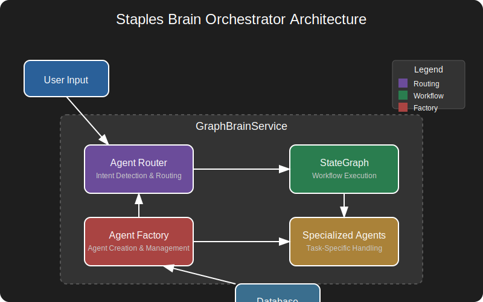

# Staples Brain Orchestrator

## Overview

The orchestrator is the central component of the Staples Brain system responsible for intelligently routing user queries to specialized agents. It implements an intent-first approach to agent selection, prioritizing pattern matching before considering conversational handling.

## Architecture



### Key Components

| Component | Description |
|-----------|-------------|
| **GraphBrainService** | Core service managing agent workflow and orchestration |
| **AgentRouter** | Routes user queries to appropriate specialized agents |
| **AgentFactory** | Creates agent instances from database definitions |
| **StateGraph** | LangGraph workflow defining execution flow between agents |

## API Integration

The orchestrator is accessible through these main endpoints:

| Endpoint | Method | Purpose |
|----------|--------|---------|
| `/api/v1/graph-chat/chat` | POST | Main chat endpoint that processes user messages through orchestrator |
| `/api/v1/graph-chat/execute-agent` | POST | Directly executes a specific agent, bypassing routing |

### Chat Request Format

```json
{
  "message": "I need to reset my password",
  "session_id": "user-123-session",
  "context": {
    "customer_id": "cust-456",
    "previous_agents": ["general_conversation"]
  }
}
```

### Chat Response Format

```json
{
  "success": true,
  "response": {
    "message": "I can help you reset your password. First, please tell me the email address associated with your account.",
    "type": "text"
  },
  "conversation_id": "conv-789",
  "external_conversation_id": "ext-123",
  "observability_trace_id": "trace-456"
}
```

## Agent Selection Flow

1. **Initial Processing**
   - User message is received via the `/api/v1/graph-chat/chat` endpoint
   - Message is validated and parsed by FastAPI using the `GraphChatRequest` model
   - `GraphBrainService.process_message()` is called with the message, session_id, and context

2. **Intent Detection (Intent-First Approach)**
   - System first tries to identify specific intents via keywords
   - Pattern matching is performed against registered agent capabilities
   - High-confidence matches (>0.7) are immediately selected

3. **Agent Selection Logic**
   ```python
   # First try to identify specific intents via keyword pattern matching
   prefiltered_agents = await agent_vector_store.keyword_prefilter(query)
   
   # If we have exactly one high-confidence match from patterns, use it directly
   if len(prefiltered_agents) == 1 and prefiltered_agents[0][1] > 0.7:
       agent, confidence = prefiltered_agents[0]
       route_context["selection_method"] = "strong_intent_match"
       return agent, confidence, route_context
   ```

4. **Fallback Mechanism** 
   - If no specialized agent matches with high confidence, the system falls back to:
      1. General Conversation agent for conversational queries
      2. LLM-based agent selection for more complex queries

## Agent Configurations

Agents are defined in the database with specific pattern capabilities that help the orchestrator identify when they should be selected:

```python
# Example of pattern capability configuration
if "reset password" in agent_definition.name.lower():
    agent_definition.pattern_capabilities.append(
        PatternCapability(
            regex=r'password|reset password|forgot password|change password|login issue',
            confidence=0.85,
            description="Password reset intent detection"
        )
    )
```

## Integration Points

| System | Integration | Purpose |
|--------|-------------|---------|
| **Database** | PostgreSQL | Stores agent definitions, patterns, and routing rules |
| **Memory System** | mem0 | Provides context management across conversation turns |
| **Telemetry** | API Observability | Records routing decisions and performance metrics |

## Implementation Details

### Initialization Process

The orchestrator is initialized during application startup:

1. `GraphBrainService.initialize()` loads agents from database
2. `create_workflow_graph()` builds the LangGraph workflow
3. Agents are registered and verified for availability

### Default Routing Workflow

The standard message processing flow:

```
User Input → Guardrails Agent → Agent Selection → Specialized Agent → Response
```

## Performance Considerations

- Agent selection uses pattern matching first for faster routing
- Regular expression matching is optimized for common intents
- Memory service leverages caching for improved response times

## Troubleshooting

| Issue | Possible Cause | Resolution |
|-------|----------------|------------|
| Incorrect agent selection | Pattern confidence too low | Adjust confidence thresholds or improve patterns |
| Missed specialized intent | Missing pattern capability | Add additional patterns to agent definition |
| Slow routing performance | Too many agents or patterns | Optimize pattern matching or reduce agent count |

## Future Improvements

- Enhanced vector-based semantic matching
- Adaptive confidence thresholds based on historical performance
- Multi-agent collaboration for complex queries