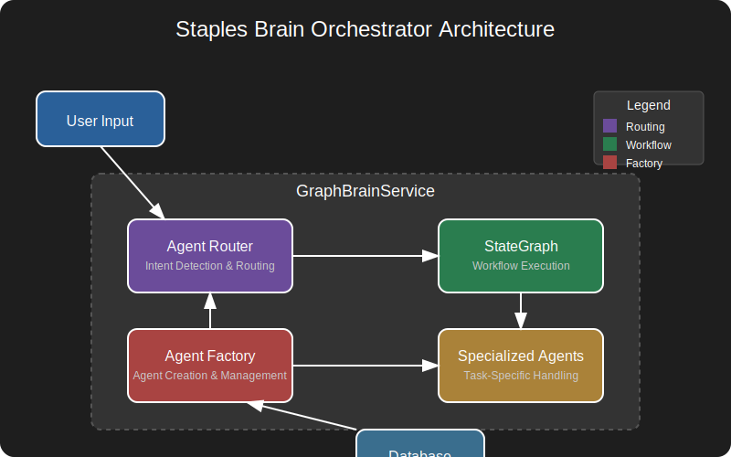

# Staples Brain Orchestrator Documentation

Welcome to the Staples Brain Orchestrator documentation. This collection of documents provides comprehensive guidance on understanding, using, and extending the orchestration system.

## Documentation Structure

| Document | Purpose | Audience |
|----------|---------|----------|
| [Orchestrator Overview](orchestrator.md) | High-level explanation of the orchestration system | Business stakeholders, new developers |
| [Technical Documentation](orchestrator_technical.md) | Detailed implementation information | Experienced developers, system architects |
| [Adding New Agents](adding_new_agents.md) | Step-by-step guide to extending the system | Developers, agent builders |

## Quick Start

If you're new to the Staples Brain system:
1. Start with the [Orchestrator Overview](orchestrator.md) to understand the high-level architecture
2. Review the [Technical Documentation](orchestrator_technical.md) to learn implementation details
3. Follow the [Adding New Agents](adding_new_agents.md) guide when you're ready to extend the system

## Key Concepts

**Orchestrator**: The central system that routes user queries to specialized agents.

**Intent Detection**: The process of identifying the user's intent from their query.

**Agent Selection**: The mechanism for choosing the most appropriate agent for a query.

**LangGraph Workflow**: The defined execution flow between system components.

## Orchestrator Diagram



## Example Usage

### Basic Agent Routing

```python
# Process user message through the orchestration system
result = await brain_service.process_message(
    message="I need to reset my password",
    session_id="user-123",
    context={}
)

# Response includes the selected agent and processed response
print(f"Selected agent: {result['agent']}")
print(f"Response: {result['response']}")
```

### Direct Agent Execution

```python
# Execute a specific agent directly
result = await brain_service.execute_agent(
    agent_id="reset-password-agent-id",
    message="I forgot my password",
    session_id="user-123",
    context={}
)
```

## Additional Resources

- [LangGraph Documentation](https://langchain-ai.github.io/langgraph/)
- [LangChain API Reference](https://api.python.langchain.com/en/latest/langchain_api_reference.html)
- [Staples Brain API Documentation](/api/v1/docs)